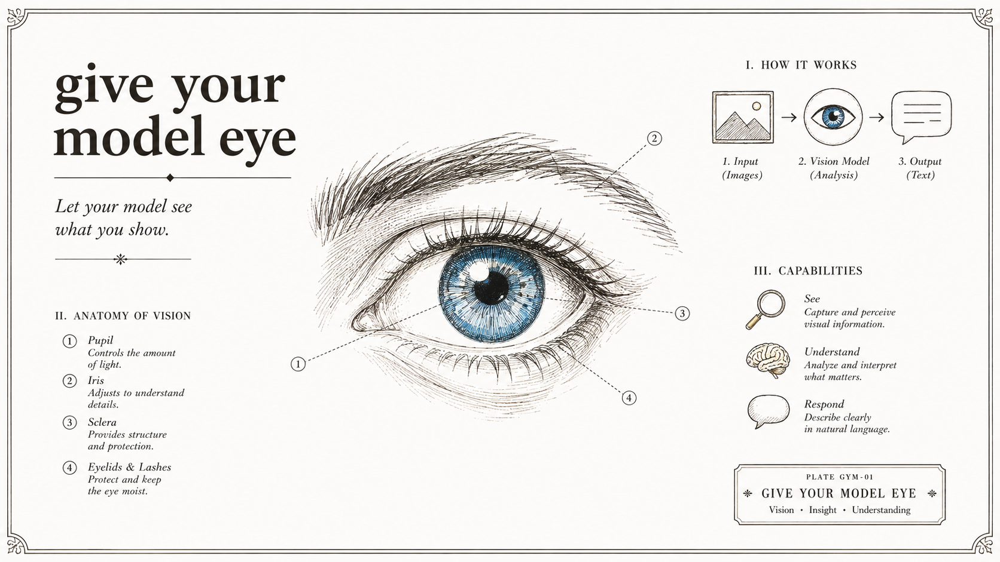

# give your model eye



Claude Code 插件：让无法直接读图的模型（文本模型 / 视觉能力受限）获得图像理解能力。

图片会发送到你配置的 OpenAI 兼容视觉模型 API，分析结果以文本返回给当前模型。

## 安装

### 方式一：一键安装（推荐，所有 agent 通用）

```bash
npx github:MLWND/give-your-model-eye
```

自动把 skill 安装到 Claude Code、Codex、opencode、Gemini、Copilot 的 skill 目录，首次运行自动进入配置向导（模型 id / API key / URL）。前提：已安装 Node.js（>= 16.7；配置向导还需 Python 3）。

> 注：一键安装只装 skill，不含 Claude Code 的自动提醒 hook（hook 需插件方式，见方式二）。若同时用插件方式安装，本地副本与插件会重复注册，建议二选一。

### 方式二：按 agent 单独安装

skill 目录来源：`git clone https://github.com/MLWND/give-your-model-eye` 后取 `skills/image-vision/`（下文 `<skill目录>` 指它）。

**Claude Code**（插件方式，唯一带 hook 自动提醒）

在 Claude Code 会话内执行：

```bash
/plugin marketplace add MLWND/give-your-model-eye
/plugin install image-vision@image-vision
```

本地测试：`claude --plugin-dir <本仓库路径>`

**Codex CLI**

```bash
npm install -g @openai/codex   # 如未装
codex login                    # 登录（ChatGPT 订阅或 API key）
mkdir -p ~/.codex/skills
cp -r <skill目录> ~/.codex/skills/
# 使用：会话内 $image-vision 或 /skills
```

**opencode**

```bash
npm install -g opencode-ai     # 如未装
mkdir -p ~/.config/opencode/skills
cp -r <skill目录> ~/.config/opencode/skills/
# 或零迁移：opencode 原生读 ~/.claude/skills/，装过 Claude Code 版就不用动
# 使用：按 description 自动触发
```

**Gemini CLI**

```bash
npm install -g @google/gemini-cli   # 如未装
mkdir -p ~/.gemini/skills
cp -r <skill目录> ~/.gemini/skills/
# 或 gemini skills link <skill目录>
# 使用：激活时确认
```

**Copilot CLI**（需 Copilot 订阅）

```bash
npm install -g @github/copilot   # 如未装
mkdir -p ~/.copilot/skills
cp -r <skill目录> ~/.copilot/skills/
# 使用：自动发现
```

### 配置（所有方式最后一步）

**首次使用运行配置向导，输入模型 id / API key / URL 即可**：

打开终端（PowerShell / Git Bash / cmd），进入 skill 目录后运行：

```bash
cd ~/.agents/skills/image-vision
python scripts/setup.py
```

> 一键安装后首次运行会自动进入向导，无需手动执行；再次运行 `npx github:MLWND/give-your-model-eye --setup` 可重开向导修改配置（已配置过，直接回车保留现有值）。Windows cmd 请用 `%USERPROFILE%` 代替 `~`。

配置写入 `~/.claude/image-vision.json`，所有 agent 共用。URL 可填 base 地址（自动补全 `/chat/completions`）或完整端点。

手动方式：`cp skills/image-vision/config.example.json ~/.claude/image-vision.json` 并编辑。

然后重启 Claude Code。

## 各 agent 的 skill 位置与调用方式

| Agent | 安装位置 | 调用方式 |
|---|---|---|
| Claude Code | 插件市场安装（见上） | 自动触发 + hook 提醒 |
| Codex CLI | `~/.codex/skills/image-vision/` | 会话内 `$image-vision` 或 `/skills` |
| opencode | `~/.config/opencode/skills/image-vision/`（或直接复用 `~/.claude/skills/`，零迁移） | 按 description 自动触发 |
| Gemini CLI | `~/.gemini/skills/image-vision/`，或 `gemini skills link <路径>` | 激活时确认 |
| Copilot CLI | `~/.copilot/skills/image-vision/`（个人）或 `.github/skills/`（项目） | 自动发现 |

SKILL.md 是跨 agent 的开放标准（[agentskills.io](https://agentskills.io)），skill 目录可原样用于各 agent，无需改写。hook（自动提醒）为 Claude Code 专属，其他 agent 无此机制，但 skill 本身不受影响。

## 功能

- **skill**：模型读不了图时自动分析图片（本地文件、URL、粘贴截图），支持文本/JSON 结构化输出、多轮追问、大图自动压缩
- **hooks**：Read 图片文件、Bash 直接读图、用户消息含图时，自动提醒模型调用 skill

## 隐私

图片会发送到所配置的 API 端点（第三方服务）。敏感截图请先评估。
